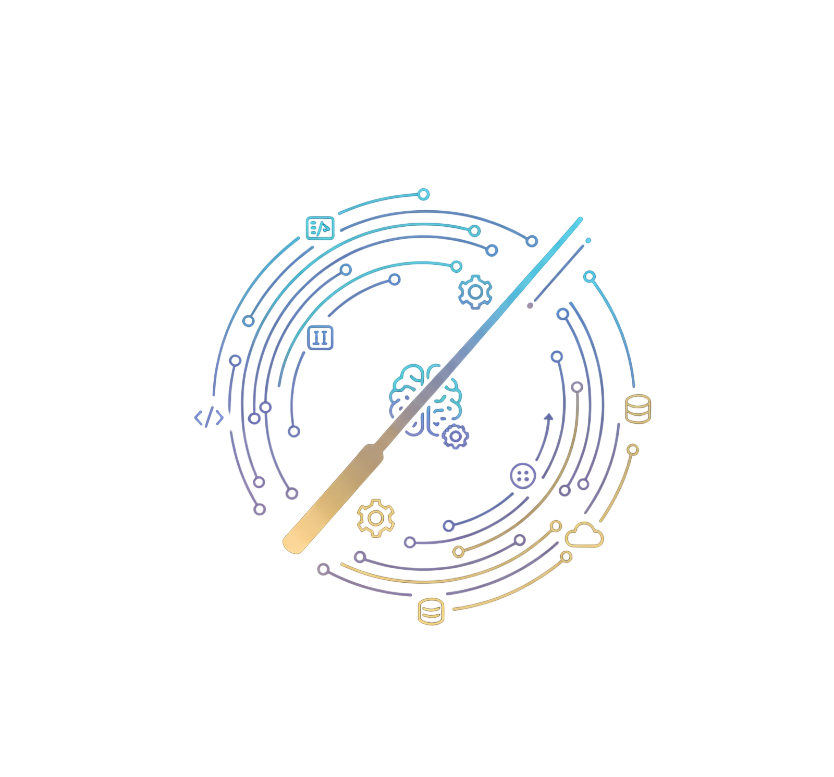

<div align="center">
  
</div>

<h1 align="center">Orchestra</h1>

<p align="center">
  <strong>The A.S.A.P. — AI SDLC Automation Platform for modern engineering teams.</strong>
</p>

<p align="center">
  <a href="https://arturhaikou.github.io/orchestra/">📖 Documentation</a> ·
  <a href="https://github.com/arturhaikou/orchestra/issues">Report an Issue</a> ·
  <a href="https://github.com/arturhaikou/orchestra/issues">Request a Feature</a>
</p>

---

> **Note:** This solution was built with [spec-workflow](https://github.com/arturhaikou/spec-workflow).

**Orchestra** eliminates the friction between issue creation and code delivery. It unifies your trackers — Jira, GitHub, and GitLab — into a single control plane, then assigns intelligent AI agents to act on them. Rather than passively tracking work, Orchestra actively orchestrates it.

---

## Why Orchestra?

Modern engineering teams face a consistent problem: AI tooling is fragmented. Each platform — Jira, GitHub, GitLab — has its own AI surface with inconsistent capabilities and separate configuration. Teams end up duplicating effort, managing disconnected settings, and still falling short of true automation.

Orchestra solves this by providing a **unified AI automation layer** across your SDLC. Configure your agents, tools, skills, and integrations once — then let Orchestra direct the performance.

### How It Works

| Layer | Role |
|---|---|
| **The Instruments** | Connect your trackers (Jira, GitHub, GitLab) into a single unified view |
| **The Musicians** | Autonomous AI agents assigned to specific ticket types — code, review, or search |
| **The Sheet Music** | Configurable workflows with triggers, conditions, and agent handoffs |
| **The Conductor** | You — overseeing the entire lifecycle from a single dashboard |

---

## Key Features

### Unified Ticket Management
- Aggregate issues and tickets from **Jira** (Cloud & On-Premise), **GitHub Issues**, and **GitLab** in a single interface
- Real-time synchronization with source trackers

### AI Agent System
- Create and configure fully autonomous agents with custom instructions, tools, and skills
- Three built-in agent templates to get started immediately:
  - **Code Review Agent** — automated PR/MR analysis via GitHub or GitLab (read-only access)
  - **Agentic Search Agent** — deep codebase exploration and summarization (read-only CLI)
  - **Coding Agent** — end-to-end implementation with full read/write access (CLI agent)
- Assign agents to tickets and monitor execution in real time via a live job view

### AI Provider Support
- **Azure OpenAI** — hosted model deployments configured per workspace
- **Ollama** — self-hosted model support with live model discovery

### AI CLI Integration — GitHub Copilot
- Connect **GitHub Copilot** directly to Orchestra as the agent execution runtime
- Automatic model discovery from your Copilot subscription
- Configurable reasoning effort and tool access levels (read-only vs. read/write)

### MCP Server Management
- Register and manage **Model Context Protocol (MCP)** servers as tool sources for agents
- Supports **stdio** and **HTTP** transport types
- Authentication options: API Key, OAuth2, Bearer Token, or Custom
- Automatic **tool danger-level classification** to prevent unintended destructive operations
- Live tool discovery and sync from connected MCP servers

### Skills & Tools System
- Define reusable **skills** (instruction sets) and organize them into folders for agent assignment
- Build and configure individual **tools** that agents can invoke during execution

### Workflow Builder
- Design multi-step automated workflows with a visual canvas
- Configure triggers, conditional branching, and sequential agent handoffs
- Track per-step execution status in real time

### Background Job Execution
- All agent work runs asynchronously via a dedicated **.NET Worker service**
- Real-time job status updates and sub-agent visualization via **SignalR**
- Session recovery and job resumption after service restarts

### Multi-Tenant Workspaces
- Full workspace isolation with scoped agents, tools, integrations, and skills
- Each workspace carries its own AI provider configuration
- JWT-based authentication with per-workspace access control

### ADF Content Conversion
- Full two-way **Atlassian Document Format (ADF)** conversion for accurate Jira content rendering
- Powered by a dedicated Node.js microservice

---

## Architecture

Orchestra is a distributed application orchestrated by **.NET Aspire 9**:

```
┌─────────────────────────── .NET Aspire Orchestrator ─────────────────────────────┐
│                                                                                    │
│  ┌──────────────────┐   ┌─────────────────────┐   ┌──────────────────────────┐   │
│  │   React 19 UI    │   │  CopilotKit Runtime  │   │     ADF Generator        │   │
│  │   (Port 3002)    │   │     (Port 3001)       │   │     (Port 3300)          │   │
│  └────────┬─────────┘   └──────────┬──────────┘   └────────────┬─────────────┘   │
│           │                        │                            │                  │
│           └────────────────────────┴────────────────────────────┘                  │
│                                         │                                          │
│  ┌──────────────────────────────────────▼───────────────────────────────────────┐ │
│  │                    .NET 10 API Service  (Port 3000)                          │ │
│  │          REST Controllers · Clean Architecture · SignalR Hubs               │ │
│  └──────────────────────────────────────┬───────────────────────────────────────┘ │
│                                         │                                          │
│  ┌──────────────────────────────────────▼───────────────────────────────────────┐ │
│  │                    .NET Worker Service (Background)                          │ │
│  │       Agent Execution · DB Migrations · Job Resume · Session Recovery       │ │
│  └──────────┬──────────────────────────────────────────────────┬───────────────┘ │
│             │                                                    │                 │
│  ┌──────────▼──────────┐                          ┌─────────────▼──────────────┐  │
│  │     PostgreSQL       │                          │           Redis             │  │
│  │  (Primary Database)  │                          │  (SignalR Backplane)        │  │
│  └─────────────────────┘                          └────────────────────────────┘  │
│                                                                                    │
│  External:  Jira · GitHub · GitLab · Azure OpenAI · Ollama · MCP Servers          │
│             GitHub Copilot CLI                                                     │
└────────────────────────────────────────────────────────────────────────────────────┘
```

### Service Responsibilities

| Service | Responsibility |
|---|---|
| **React 19 UI** | Conductor's dashboard — agents, tickets, workflows, jobs, MCP, CLI, skills |
| **CopilotKit Runtime** | Agentic UI communication layer (Node.js) |
| **ADF Generator** | Atlassian Document Format bidirectional conversion (Node.js) |
| **.NET 10 API** | Core business logic, Clean Architecture, REST endpoints, SignalR hubs |
| **.NET Worker** | Background agent processing, DB migrations, job orchestration |
| **PostgreSQL** | Primary relational store via Entity Framework Core |
| **Redis** | SignalR scale-out backplane |

---

## Tech Stack

| Category | Technologies |
|---|---|
| **Backend** | .NET 10, .NET Aspire, Entity Framework Core |
| **Frontend** | React 19, Vite, TypeScript, Tailwind CSS, React Flow, Recharts |
| **Database** | PostgreSQL |
| **Cache / Real-Time** | Redis, SignalR (WebSockets) |
| **AI** | Microsoft Agents Framework, Azure OpenAI, Ollama |
| **Auth** | JWT Bearer, bcrypt |
| **Integration Protocol** | Model Context Protocol (MCP) |
| **Services** | Node.js (CopilotKit Runtime, ADF Generator) |

---

## Getting Started

### Prerequisites

- [.NET 10 SDK](https://dotnet.microsoft.com/download/dotnet/10.0)
- [Aspire](https://aspire.dev/get-started/prerequisites/) — see prerequisites
- [Docker](https://www.docker.com/) or [Podman](https://podman.io/) (required for PostgreSQL and Redis containers)
- [Node.js](https://nodejs.org/) v22+
- An **Azure OpenAI** resource with a deployed model, or a running **Ollama** instance

### Quick Start

```bash
# 1. Clone the repository
git clone https://github.com/arturhaikou/orchestra.git
cd orchestra

# 2. Start the distributed application
aspire run
```

Once all services are running, navigate to the UI (port 3002), register an account, and create your first workspace. You will be prompted to configure your AI provider (Azure OpenAI or Ollama) during workspace creation.

### Configuration

AI provider credentials (endpoint, API key, model deployment name) are stored **per workspace** in the database and configured through the application UI — no environment variables or config files are required for provider setup.

The following fields in `src/Orchestra.ApiService/appsettings.json` should be set before running in any non-development environment:

```json
{
  "Encryption": {
    "Key": "<your-encryption-key>"
  },
  "Jwt": {
    "Issuer": "https://api.orchestra.local",
    "Audience": "https://api.orchestra.local",
    "SecretKey": "<your-jwt-secret>"
  }
}
```

> The defaults in the repository are placeholder values suitable for local development only. Replace them before any deployment.

---

## Roadmap

Orchestra is under active development. The following capabilities are planned for upcoming releases:

| Area | Details |
|---|---|
| **Additional CLI Integrations** | Support for **Claude** (Anthropic), **Gemini** (Google), **Cursor**, and **Windsurf** alongside the existing GitHub Copilot integration |
| **Expanded Tracker Support** | Azure DevOps and Linear ticket synchronization (providers are modelled; sync implementation is in progress) |
| **Knowledge Base Integrations** | Confluence and Notion as readable knowledge sources for agent context |
| **Additional AI Providers** | AWS Bedrock, Anthropic Claude (direct API), and Google Gemini (direct API) as workspace-level provider options |
| **Built-in Tool Library** | Pre-configured tools for Git operations, code analysis, test execution, and deployment automation |
| **Workspace Templates** | Clone agents, tools, skills, and integrations across workspaces for rapid environment provisioning |
| **Vectorization & RAG** | Vector embeddings and semantic search over knowledge bases to enhance agent retrieval accuracy |
| **Workflow Enhancements** | Webhook-triggered automations and cross-agent handoff improvements |
| **Analytics & Observability** | Agent performance metrics, ticket resolution time tracking, and an execution insights dashboard |
| **Enterprise Controls** | Audit logging, role-based access control (RBAC), and compliance reporting |

Have a suggestion? [Open an issue](https://github.com/arturhaikou/orchestra/issues) or submit a pull request.

